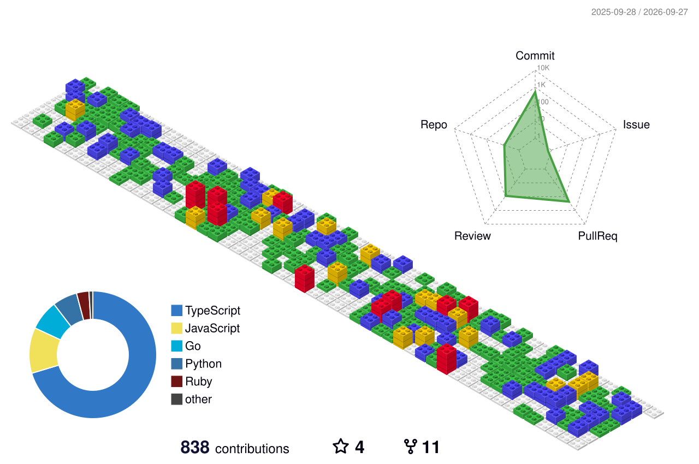

### Hi, I’m Vishnu

Full-stack product engineer building and scaling products across **consumer, commerce and AI**.
You can find my work at:
[Studio](https://www.opusco.dev) · [Portfolio](https://www.vishnushon.com)

### What I’ve shipped

- **[BeenVerified](https://www.beenverified.com/) (New York):** Built core consumer experiences and shipped platform features end-to-end.
- **[OpusCo](https://www.opusco.dev/):** Founded and lead an engineering studio building commerce platforms and custom software for growing businesses.
- **[Respct](https://www.crunchbase.com/organization/respct):** Founding engineer on a social NFT product that raised **$1M** through **Tachyon** and **Polygon LEAP**.
- **[StayBook](https://staybook.in/):** Built and scaled a booking engine serving **500+ hotels** and **40K+ daily users** across India.

### My Tools

