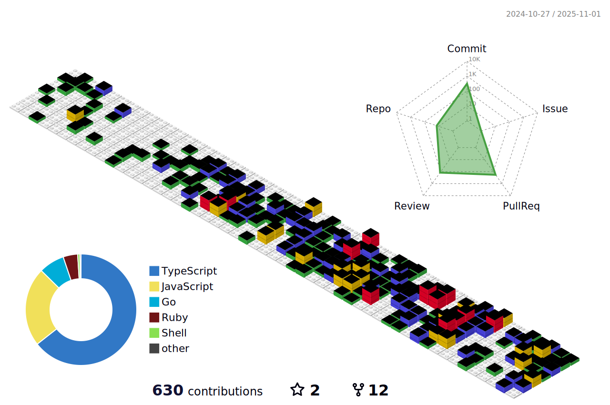

### 🙋🏻‍♂️ Hi, I'm Vishnu Shon.
I'd love to share a bit about myself:
 - Founding developer at a startup called [Respct](https://www.crunchbase.com/organization/respct), led the frontend team to round seed funding at [PolygonLEAP](https://inc42.com/buzz/meet-the-31-web3-startups-that-are-part-of-first-cohort-of-polygonleap-2021/) and [Tachyon Accelerator'21](https://tachyon.xyz/alumni/) and scaled it to [5000+](https://twitter.com/TachyonAccel/status/1511033230346051590) users.
 - Developed winning projects at global hackathons like [Ethereum India '22](https://ethglobal.com/showcase/alkynefi-nampv) and [Polygon BUIDL IT '22](https://devpost.com/software/reverelabs-dzpu4k).
 - Developed and scaled StayBook (a booking engine business) to **200+** hotels and **20,000** active customers.
 - SDE summer intern at **MathWorks**, audited Simulink 3D Editor. 
 - Even teamed up with the **Indian Government** for a GIS software (long story...)
 - 
**I like user needs more than software vitamins.**
P.S. Check out my work on www.vishnushon.com 

### My Tools 🛠

### My Skills 🦇

